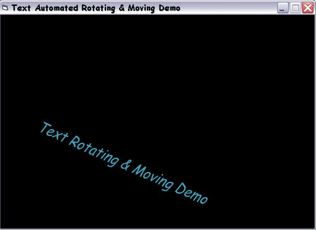



## Text Automated Rotating & Moving Demo

### Description

This code makes a text moves! The colour of the text will change automatically. This code uses Direct Animation Library and only 1 sub. Comments are welcomed. Please vote.
 
### More Info
 

             |
---                |---
**Submitted On**   |2003-09-21 21:18:02
**By**             |[Lam Ri Hui](https://github.com/Planet-Source-Code/PSCIndex/blob/master/ByAuthor/lam-ri-hui.md)
**Level**          |Beginner
**User Rating**    |4.8 (19 globes from 4 users)
**Compatibility**  |VB 4\.0 \(16\-bit\), VB 4\.0 \(32\-bit\), VB 5\.0, VB 6\.0
**Category**       |[Graphics](https://github.com/Planet-Source-Code/PSCIndex/blob/master/ByCategory/graphics__1-46.md)
**World**          |[Visual Basic](https://github.com/Planet-Source-Code/PSCIndex/blob/master/ByWorld/visual-basic.md)
**Archive File**   |[Text\_Autom1648799222003\.zip](https://github.com/Planet-Source-Code/lam-ri-hui-text-automated-rotating-moving-demo__1-48707/archive/master.zip)

